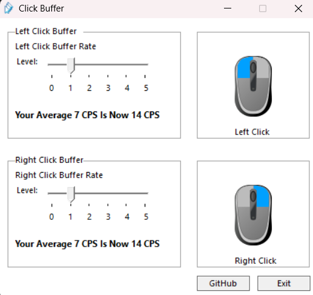

# Click-Buffer
Are you tired of clicking fast? your mouse is so bad that you can't click fast? click faster with click buffer!

Written in C. WIN32 BASED

Features:
Adjustable click buffer rate.

How it works:
The program detects if you are clicking fast to buffer the clicking output so you can still do your normal job fine even when the program is on.

How to Use:
Option 1: Run The .exe file 
Option 2: Clone the repository and compile it yourself In VScode
Option 3: Compile using the cmds in the compile.txt

Download:
You can download the latest .exe from the Releases tab.

License:
MIT License — do whatever you want with it.